# kanban_to-do_list
Following along with a React tutorial https://medium.com/codex/building-a-to-do-list-app-using-react-hooks-and-styled-component-7e413a16b91e

# Einsendeaufgaben

1. Erstellen Sie sich ein Repository in Github oder GitLab.
Repository wurde über Github erstellt und über VS Code geklont, dann switch in die Konsole für die Dokumentation.
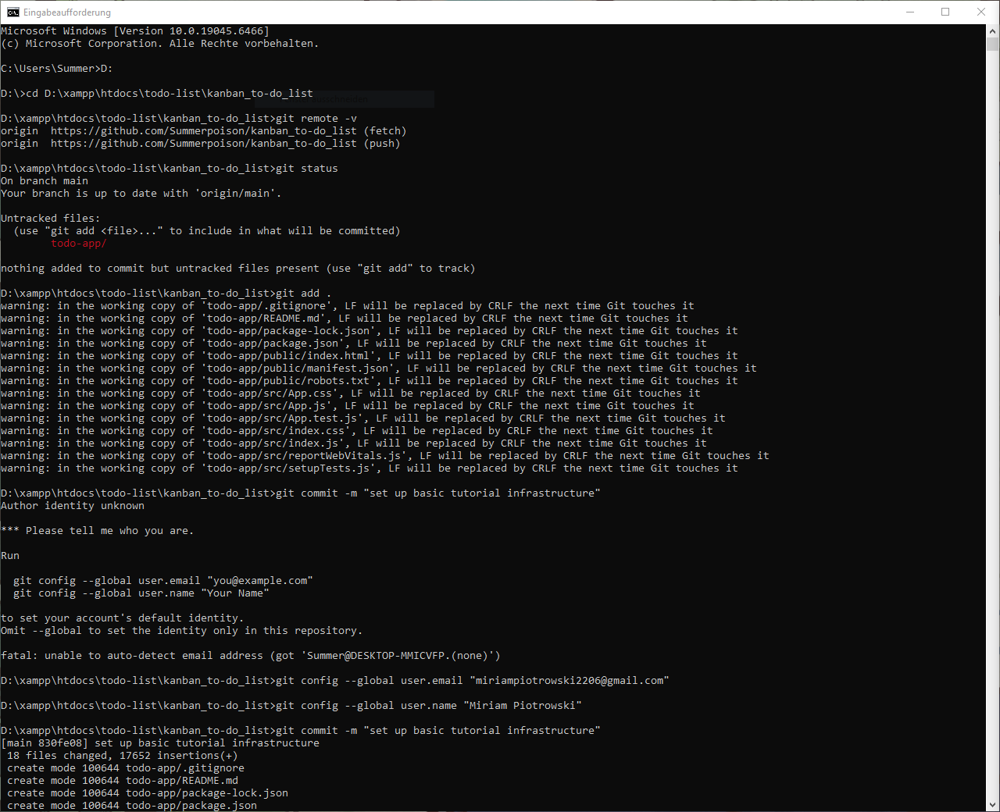

2. Pushen Sie ein eigenes Projekt von Ihnen hoch (z. B. das CCD-Projekt) oder erstellen Sie ein neues Projekt!
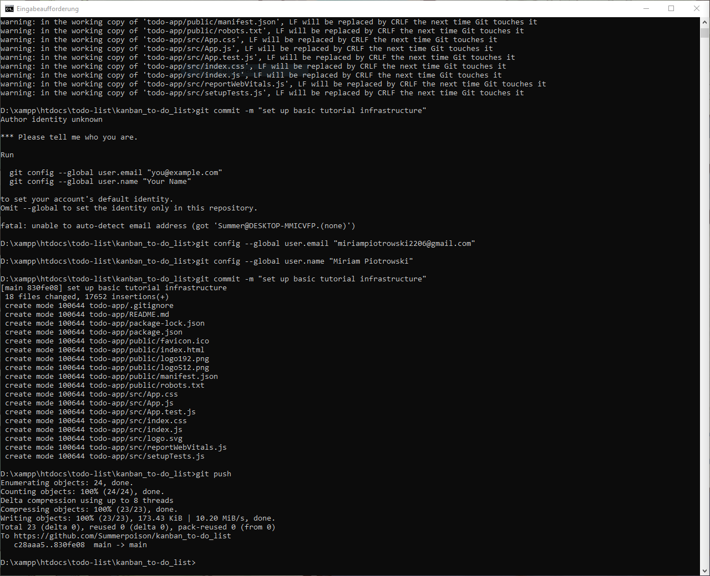

3. Wenden Sie alle in der Lerneinheit genannten relevanten Methoden beweisbar an: (das Github Repo ist Beweis) push, pull, add, commit, diff, status, rm/mv, etc.
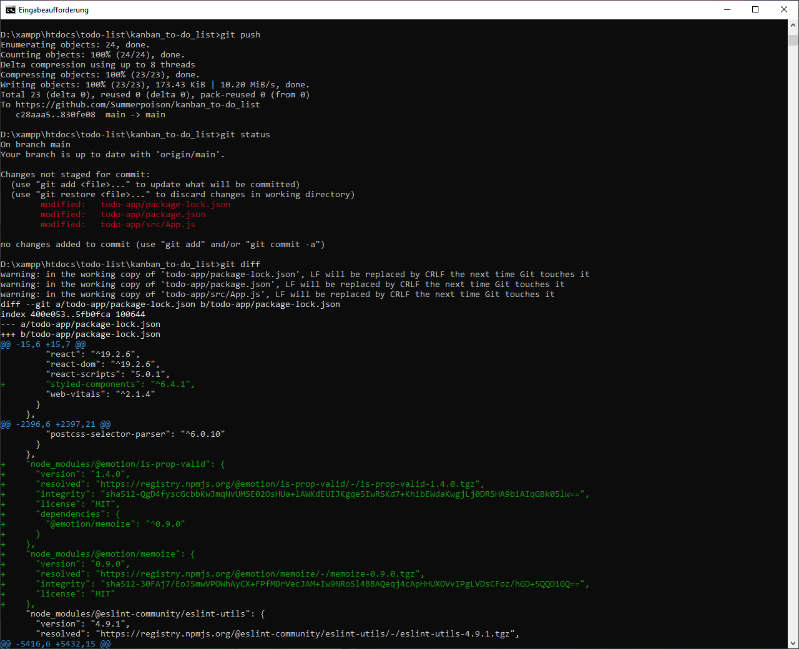

4. Experimentieren Sie mit Zeitreisen!
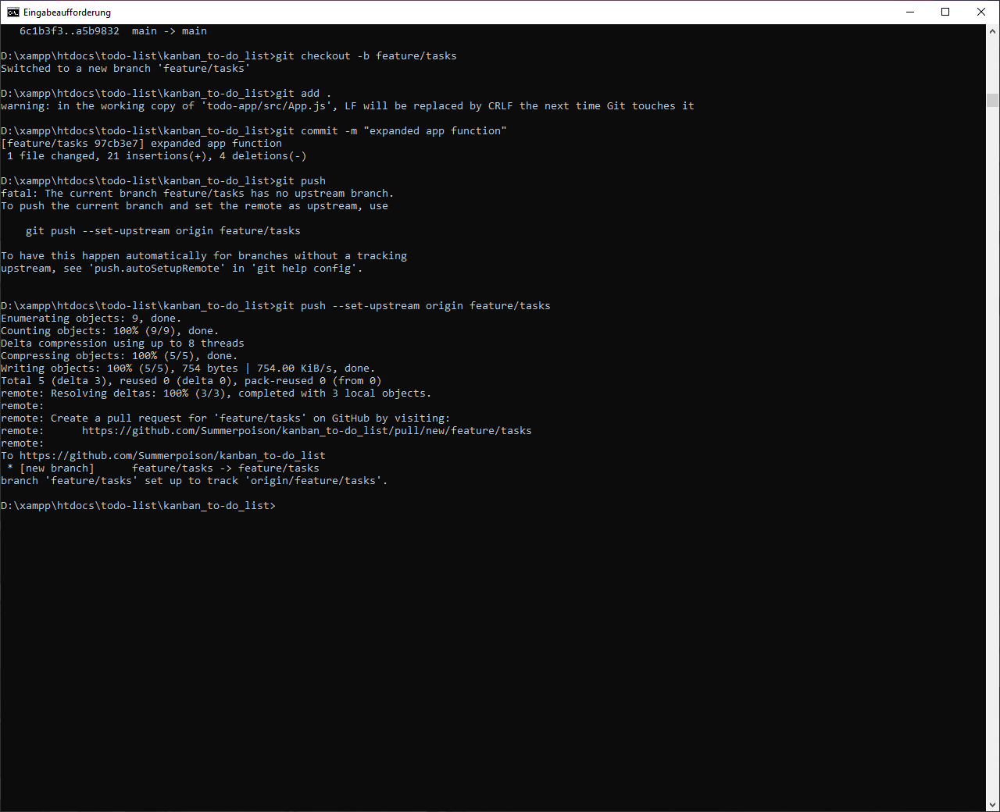
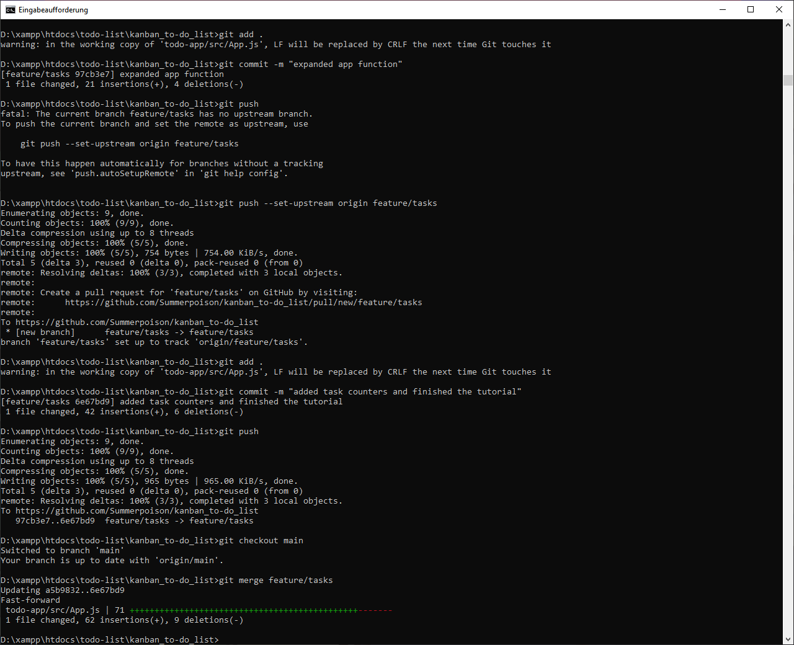

5. Erstellen Sie zwei unterschiedliche aber ähnliche Branches, wechseln Sie hin und her und mergen sie diese Branches dann wieder!
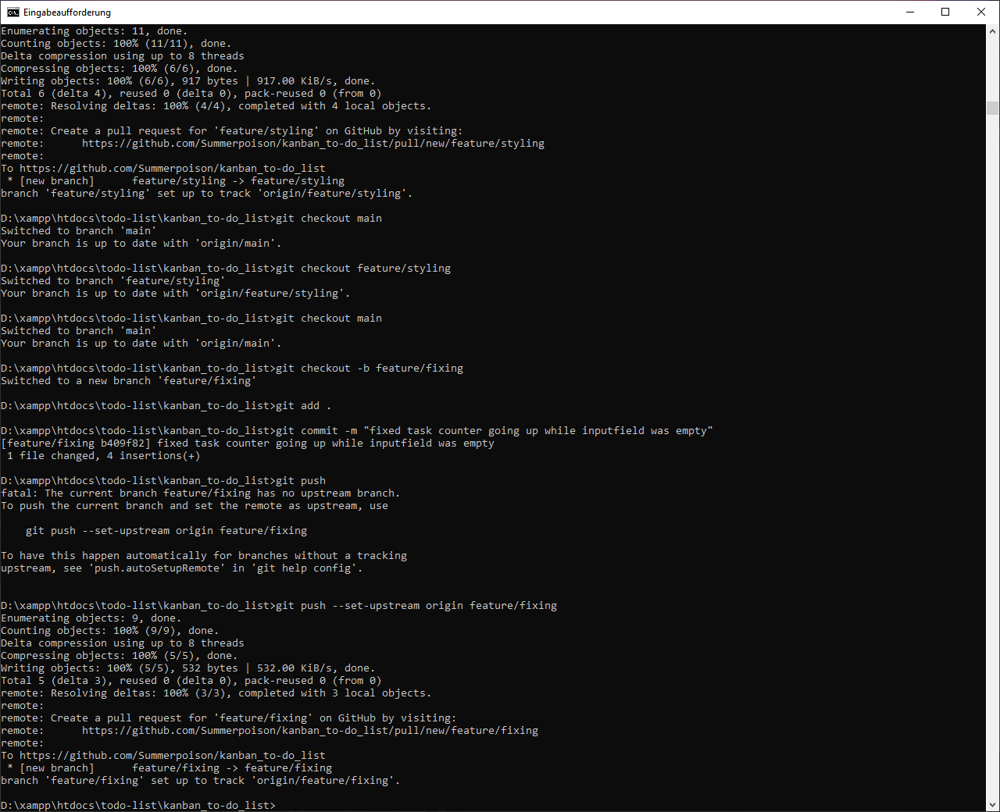
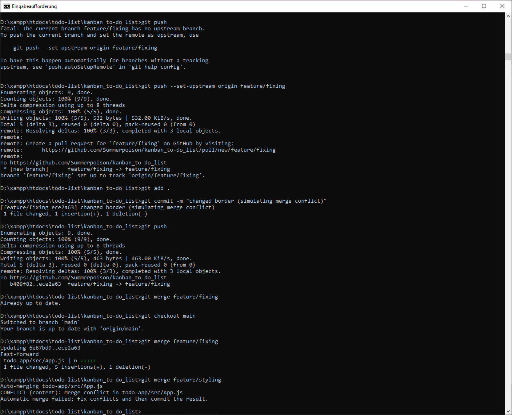
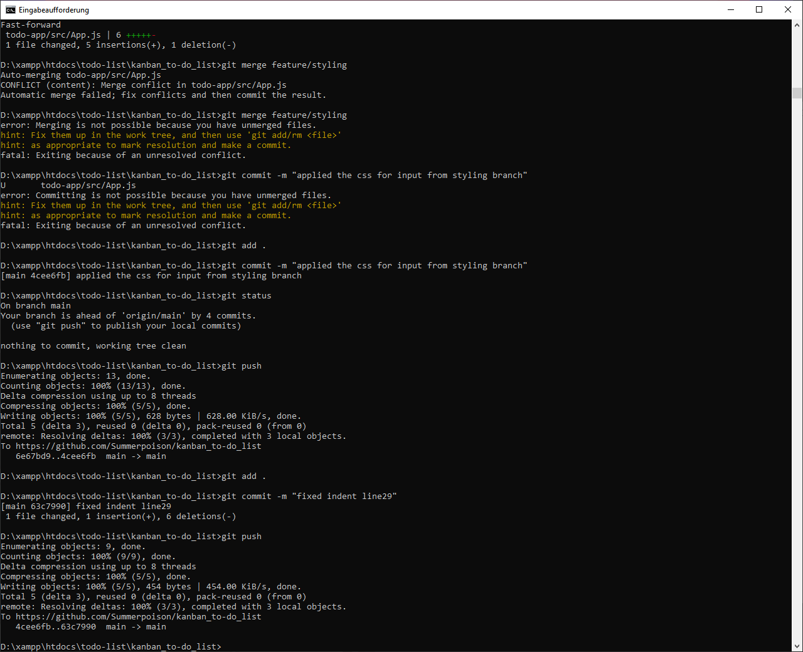

6. Erstellen Sie in GitHub einen Pull-Request bezugnehmend auf https://github.com/edlich/education! (was kleines, nützliches, witziges, etc., aber nicht via Shell, sondern via GitHub click!)
PR für Einsendeaufgabe Versionskontrolle#602

# Optische Änderungen

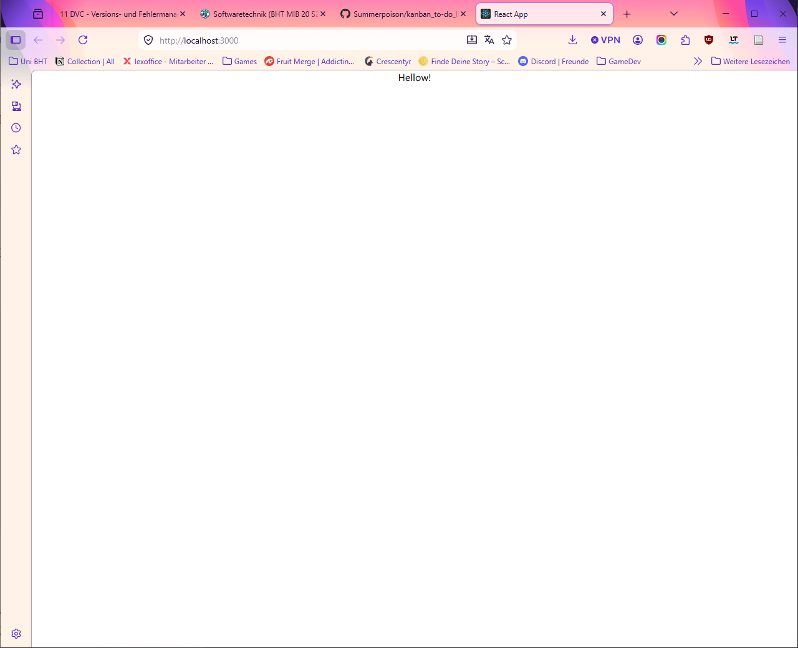
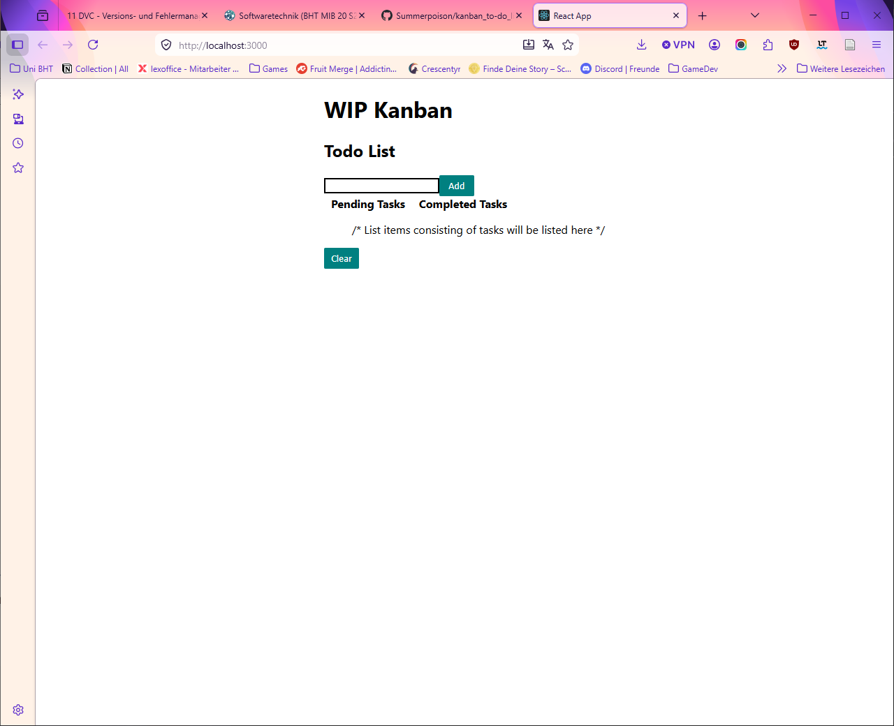
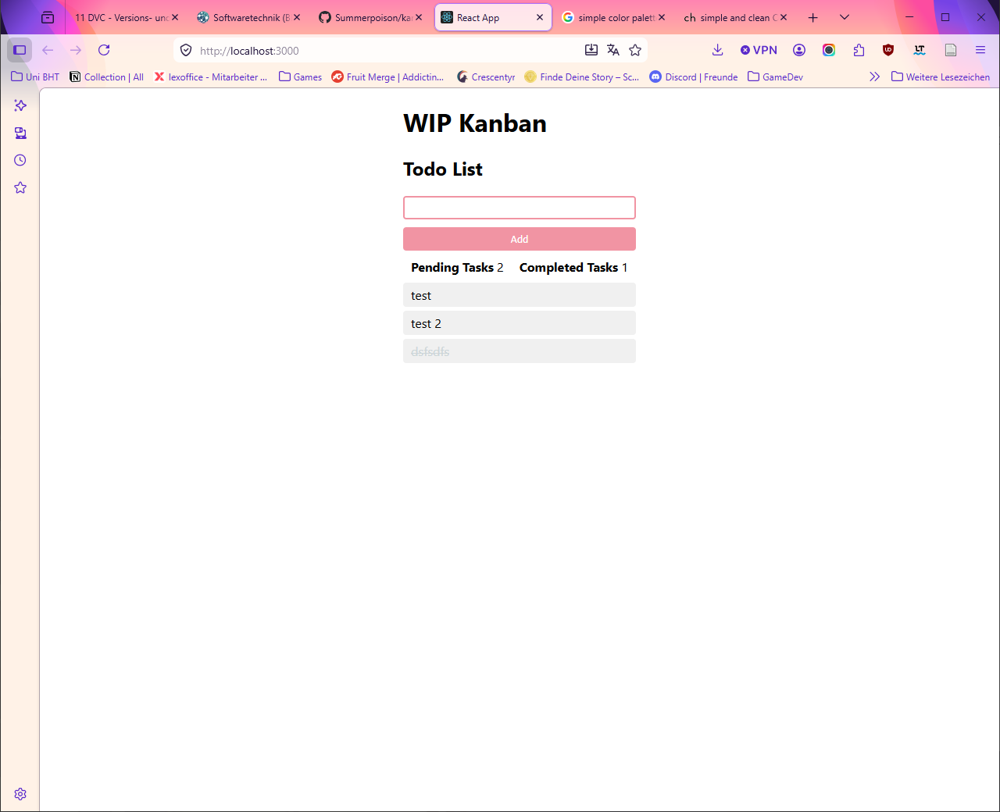
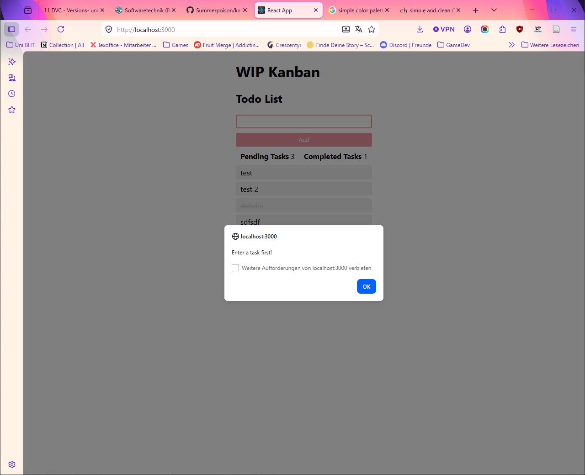

# Sonstiges

Tutorial war nicht besonders gut, teilweise Schritte nicht erklärt oder im Text-Tutorial weggelassen, die im Video sichtbar waren. Counter zählt direkt bei "onClick" hoch, sprich Tasks konnten so "angelegt" aber nicht abgehakt werden (nicht Fokus des Tutorials, aber einfacher fix).
